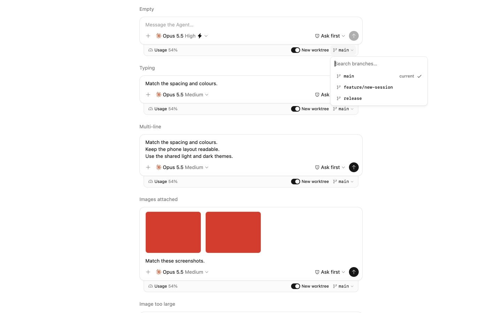
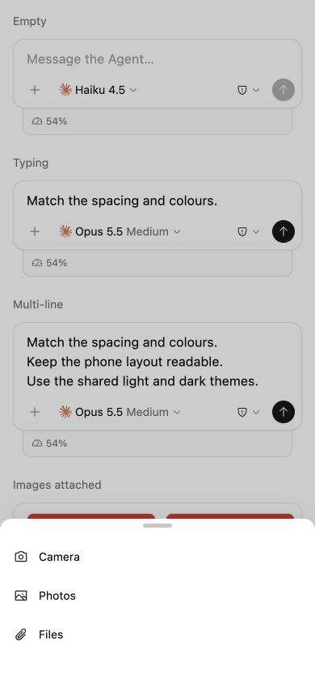

# Blind visual audit: Composer menu interiors

Independent audit on 2026-10-06. Primary design: [Paper / Session](https://app.paper.design/file/01M44G6AG3HPXGPPPMKS9S3H8J/p-3-0). Token content hash: `2737d693`. No source or Paper changes. No previous audit, checklist, or PR conclusions were used.

## Method and coverage

Read AGENTS.md, Paper and Storybook agent guidance, Expo overview, and Uniwind skills. Expected values come from the current Paper connector's `get_jsx`, `get_computed_styles`, `get_tokens`, and tree hierarchy; Paper screenshots were used only to verify appearance. Actual values come from the rendered DOM through CUA and current component source.

Inspected masters in **Components / Agent and model menu** and **Components / Composer overlays**, plus the actual Session Mobile copies for Agent/model settings, Agent page, Model page, Mode sheet and Attach sheet. Inspected Session Desktop hierarchy; its two normal Session copies do not have these menus open. The master desktop popup is therefore the desktop design reference.

Storybook: actual `sessions-composer--overview` at localhost:6008, default theme, desktop 1440×900 and phone 390×844, light and dark. Also visited the actual `tests-composer--scrollable-agent-catalog` component fixture, and drove its scroll independently; assertions in the play function were not used as audit evidence. Fonts reported `loaded` after awaiting `document.fonts.ready`. Popup measurements were taken after state observation and with computed transform `none`. CUA does not expose `document.getAnimations()`; finite animation completion was verified through settled state/bounds and screenshots rather than that API.

| Area | Actual inspection |
| --- | --- |
| Desktop Agent/model | Full menu bounds, Agent/model selected rows, Fast switch, keyboard stepped Effort, light/dark |
| Agent column scrolling | 40-Agent fixture, actual internal scroll from top to bottom, final Agent clicked |
| Phone Agent/model | Settings root, Agent page, Model page, Back, Model selection returns to root; light/dark root and both pages |
| Attach | Desktop three actions and Goal dismissal; phone Camera/Photos/Files and Photos updates attached image; light/dark |
| Mode | Full rows/selection, actual Accept edits and Plan mode selection/dismissal; light/dark desktop/phone |
| Branch | Desktop full choices, current marker, selected check, focused search, case-insensitive filtering and empty result; light/dark |
| Common surfaces | Desktop radius/border/shadow and phone radius/shadow/grabber/scrim/full bounds |

Excluded toolbar/footer trigger appearance and Plan, Context and Usage interiors.

## Actionable visual differences

### 1. Branch selection has no persistent row background

Paper **Components / Composer overlays → Row / Base branch picker → Cell / Desktop → main (selected)** has `backgroundColor: var(--color-accent)` across the entire row. Actual selected `main` has `aria-pressed=true`, a plain 14px check, and `backgroundColor: rgba(0,0,0,0)`; the search field owns focus, so this is not a hover artifact. The user explicitly requires selection background behind icon, text and check. Add the selected background to the full Button.

Code: `packages/client/src/components/ComposerConfiguration.tsx:851–859`. Evidence: [light branch](screenshots/menus/desktop-branch-light.jpg), [dark branch](screenshots/menus/desktop-branch-dark.jpg).

### 2. Branch search loses its icon, divider, and row rhythm

Paper **Base branch picker / Search** is a 40px row with 12px horizontal padding, a 14px magnifier, 8px gap, placeholder **Find a branch…**, and a 1px bottom `--color-border` divider. Actual is a standalone 40px Input, placeholder **Search branches…**, with no magnifier or bottom divider. Paper choice container has 4px padding and 2px row gaps. Actual has no top padding and no gaps: its 32px rows start directly at search bottom y=203, then y=235 and y=267. Horizontal padding is also 12px rather than Paper's 8px (the generic direct-SVG Button rule wins). Restore the search composition and container rhythm. The focused input has outline style `none` and a zero-width focus ring: the no-outline override passes.

Code: `packages/client/src/components/ComposerConfiguration.tsx:832–859`; generic SVG padding in `packages/client/src/primitives/button.tsx:43–45`. Evidence: [branch](screenshots/menus/desktop-branch-light.jpg).

### 3. Effort labels do not align with the evenly spaced steps

Paper **AgentModelMenu / Effort / Labels** uses equal 4px anchor slots, centered interior labels, and edge-aligned endpoint labels. Actual label Buttons have intrinsic widths distributed using `justify-between`; unequal label widths shift the interior centers away from the steps. At desktop, dot centers are x=636, 726.5, 817, 907.5, 998. Interior label centers are Medium=723.18, High=810.81, Extra high=904.27: errors of −3.32px, −6.19px, −3.23px. The same offsets recur at 390px phone. All labels remain one line and update selection correctly, but full alignment does not pass. Give interior labels the same step anchors as the Slider, with edge handling for endpoints. Preserve adapter-provided labels/counts.

Code: `packages/client/src/components/ComposerConfiguration.tsx:390–414`; dots in `packages/client/src/primitives/slider.tsx:50–69`. Evidence: [desktop](screenshots/menus/desktop-agent-light.jpg), [phone](screenshots/menus/phone-settings-light.jpg).

### 4. Agent rows are inset too far, and their corner radius is wrong

Paper **AgentModelMenu / Two-pane / Agent row (selected)**: 8px horizontal padding, 6px radius, 16px logo, 8px desktop gap. Actual: computed 12px horizontal padding and 8px radius, despite the source `px-2`, because the generic Button `has-[>svg]:px-3` rule is active. The Agent Button lacks `rounded-sm`. Phone Agent rows also have 12px padding and 8px radius against Paper's 8px/6px. The desktop first logo lane is 4px farther right than Paper relative to its row. Apply explicit SVG-aware 8px padding and 6px radius to this interior row.

Code: `packages/client/src/components/ComposerConfiguration.tsx:206–217`; `packages/client/src/primitives/button.tsx:43–45`. Evidence: [desktop](screenshots/menus/desktop-agent-light.jpg), [phone Agent page](screenshots/menus/phone-agent-page-light.jpg).

### 5. Desktop menu header-to-row spacing is 2px too large

Paper **AgentModelMenu / Two-pane** uses 4px container padding, a 24px heading and a 2px gap before the first row: first row begins 31px below the popup outer top, including its border. Actual first Agent and Model rows begin 33px below the popup top (top=121, row top=154). The split heading/list wrappers contribute another 4px list padding rather than Paper's 2px gap. With three equal-height Model rows, the actual popup is 580×356 versus Paper 580×354. Keep the existing 580px width and match the first-row spacing.

Code: `packages/client/src/components/ComposerConfiguration.tsx:180–185, 281–287, 315, 516–535`. Evidence: [desktop](screenshots/menus/desktop-agent-light.jpg). Paper master is **Components / Agent and model menu → Row / New Session → Cell / Desktop → Popover**.

### 6. Phone Attach icons lose their circular plates and shift the text lane

Paper **AttachMenu / Camera, Photos, Files** in both master and Session Phone Attach copy: 48px rows, 12px padding, a 32×32px circular `--color-muted` icon plate, an 18px icon, and 12px gap to text. Actual row and icon sizes pass, but the icon wrapper is 20×18px, transparent, without the circular plate. Actual text begins at x=48 rather than the expected x=60 (row x=4 + padding12 + plate32 + gap12). Add the phone icon plate and preserve desktop's intentional simpler icon slot.

Code: `packages/client/src/components/Composer.tsx:279–288`. Evidence: [phone light](screenshots/menus/phone-attach-light.jpg), [phone dark](screenshots/menus/phone-attach-dark.jpg). Paper actual copy: **Session — Phone, Attach sheet (light) → Sheet (phone) → Content → AttachMenu**.

### 7. Phone Back arrow is smaller and lower contrast than Paper

Paper actual **Agent/Model page → Navigation / Back**: 18px foreground arrow in a 44×44px button, bottom header border only. Actual arrow is 16px muted foreground; header additionally uses a top border. Button dimensions (44×44), centered title (14px/20px, medium), and back interaction pass. Match the arrow's 18px foreground treatment and remove the extra top header border unless it is intentionally added to Paper.

Code: `packages/client/src/components/ComposerConfiguration.tsx:481–489`. Evidence: [Agent light](screenshots/menus/phone-agent-page-light.jpg), [Agent dark](screenshots/menus/phone-agent-page-dark.jpg), [Model light](screenshots/menus/phone-model-page-light.jpg).

### 8. Mode leading icons differ in size, tone and dangerous shape

Paper **ModeMenu / Plan mode, Ask first, Accept edits** uses 16px foreground icons in fixed 16×20px slots. Actual uses 14px muted-foreground icons in the correct slots. Paper **Bypass permissions** uses a destructive warning triangle; actual uses a destructive shield-slash from adapter metadata. The destructive label color and full selected-row background pass. Match the design icon size/tone, and reconcile the dangerous icon between Paper and adapter metadata.

Code: `packages/client/src/components/ComposerConfiguration.tsx:739–750`; `packages/agents/claude/config-options.ts:26–31`. Evidence: [desktop Mode](screenshots/menus/desktop-mode-light.jpg), [phone Mode](screenshots/menus/phone-mode-light.jpg).

### 9. Common web phone sheet bottom inset is 2px short

Paper master and Session copies **Sheet (phone)** specify 34px bottom padding. Actual `.rounded-t-xl` surface computes `padding: 0px 0px 32px`. For Attach, equal row contents give a 203px actual sheet versus Paper's 205px, placing its top 2px lower. The grabber remains 36×5 with 6px top and 8px bottom padding, radius is 14px, shadow is `0 -8px 32px -8px` at 8% black, and scrim is 20% black: those pass. Use the Paper 34px web inset; native safe-area behavior is separately unverified.

Code: `packages/client/src/components/ComposerSheet.tsx:32`. Evidence: [phone Attach](screenshots/menus/phone-attach-light.jpg).

## Paper copy drift

The phone settings master **Components / Agent and model menu → Row / New Session → Cell / Phone → Sheet → Effort** specifies `paddingBottom: var(--spacing-3)` =12px. Actual Session Mobile settings copy **Session — Phone, Agent and model (light) → Sheet → Effort** specifies literal 14px. Text/hidden items/state are allowed differences; this padding change is not. Reconcile the copy with its master before using total settings height as a target. The main findings above use the master for shared Effort geometry and both master/copy for common sheet surface values. This bounded audit does not assert that every descendant of every copy has been exhaustively normalized.

## User overrides and product scope

- Plain selection checks: verified visual pass for Agent, Model, Mode and branch. macOS AX describes pressed Buttons as checkboxes, but screenshots and SVG content show plain checks with no surrounding checkbox/radio control.
- Selection background across icon/text/check: Agent, Model and Mode pass; branch fails finding 1.
- Menu text nonselectable: sampled headings, labels and descriptions compute `user-select: none`; source explicitly uses `selectable={false}`. Fast Label uses `select-none`.
- Branch search focus outline: pass; case-insensitive filtering and lowercase rendered labels/current marker pass. Selecting a branch was not separately exercised after filtering; filter and empty states were.
- Adapter-backed Model/default Effort: observed initial **Opus 5.5 / Medium**, no visible generic Default label. Current Claude adapter resolves the recommended Model and concrete model-dependent Effort (`config-options.ts:51–83, 191–193`); Codex chooses its offered `defaultReasoningEffort` (`config-options.ts:35–39`). UI does not invent a fixed default. This was source boundary inspection plus recorded Storybook rendering, not a live CLI model-catalog verification.
- Shared stepped Slider: actual range has step=1, five adapter-supported levels and dots; ArrowRight changes Medium→High and visible selected label. One-line labels pass, alignment fails finding 3. Paper's extra levels and different Effort default are not a requirement to invent unsupported levels.
- LegendList Agent column: actual source uses LegendList. In the 40-Agent fixture its own viewport is 267px high, scrollHeight=1368px; actual scroll reaches scrollTop=1099, exposing Agent 40. Popup/Model area and heading remain in place. Final-row click succeeds. The fixture callback is static, so it does not visibly change selected Agent; this is not evidence of a product selection failure. [Top](screenshots/menus/desktop-agents-scroll-top.jpg), [bottom](screenshots/menus/desktop-agents-scroll-bottom.jpg).
- Desktop Attach actions **Files and Folder**, **Slash Commands**, **Goal** are newer product scope: the current Paper desktop Attach cell contains only a dash. Current 248px menu and action clicks were inspected, but there is no Paper desktop interior to certify. Phone Camera/Photos/Files remain covered by Paper.
- Offered Agent/Model lists and descriptions differ from Paper's placeholder catalogs. Those are adapter/fixture data, not visual drift. Likewise the offered Auto Mode can change with Model capability; it is not an extra static row to remove.

## Limitations and readiness

The phone overview does not expose a Base branch control (checkout footer is hidden at the narrow breakpoint), so its branch sheet could not be reached through actual product controls. This is unverified coverage, not a claimed phone branch pass. No browser-state injection was used to make it visible. Native iOS/Android sheet gestures, safe areas, keyboard interaction and Slider rendering were not exercised; these remain unverified, as do Electron-specific rendering and real CLI catalogs. No devices, user tabs or servers were changed. The audit tab was temporary and its viewport override was reset before closing.

Dark UI was checked against the current semantic code theme and legibility; this Paper Session page provides light menu/sheet masters and copies, so dark-specific Paper parity cannot be claimed. Default-theme token aliases, 12/14px text sizes, 16/20px line heights, 6/10/14px radii, common surfaces and light semantic colors agree where measured, subject to the exceptions above. Paper's font token stack is not byte-identical to theme.css (code adds platform fallbacks), but the rendered menus use the expected SF Pro Text family and no visible typography drift was found in that fallback ordering.

The interiors are usable and most key interactions work, but visual readiness is not complete because the selected branch background, Slider label alignment and phone Attach icon plates remain visibly wrong.
